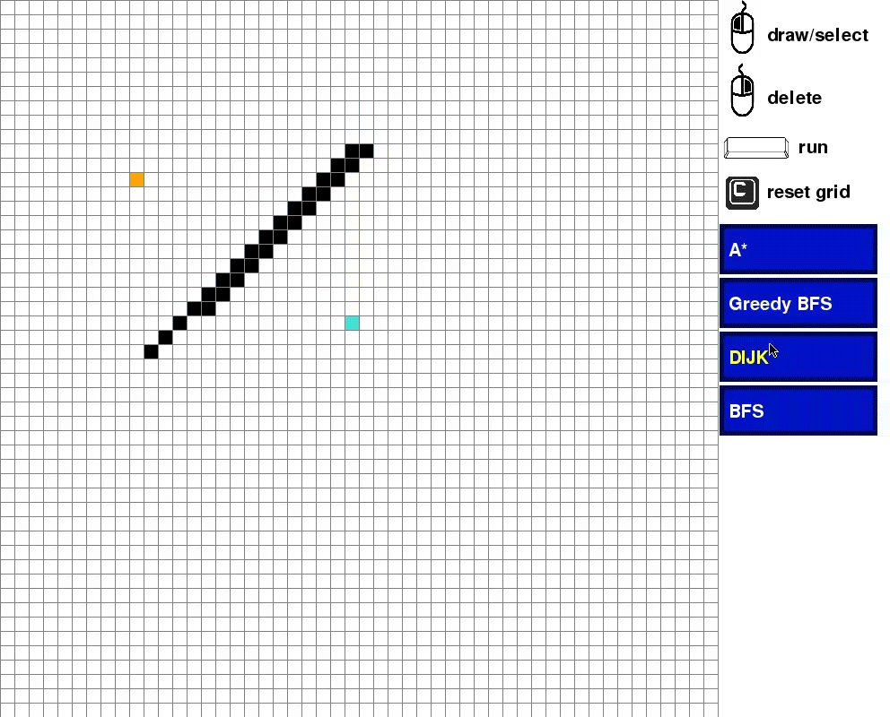

# Projects

## Pathfinding Algorithms
I implemented the A*, Dijkstra, Greedy Best First Search and the Breadth-First Search algorithm with a Pygame GUI. A more detailed README version can be found in its subfolder

In this example, the Dijkstra algorithm can be seen. The orange node depicts the start point, the turquoise node the end point and black nodes correspond to an obstacle. The algorithm proceeds through the grid and marks visited nodes in light blue. Finally, the shortest path between the two nodes is highlighted in yellow.

## Sudoku Solver
For this project I implemented a Sudoku solver (for a 9x9 grid) with a non-recursive Backtracking algorithm (in C++ and Python). The plan is to extend this project in the future, by reading Sudokus with text recognition (OCR) into the data structure.

## Scraper Script
A scraper script I used at the launch of new graphics cards. Even though the demand for the product was higher than its availability, I managed to get a graphics card with the help of this script :)!

The script was designed specifically for the www.caseking.de graphics card section. You might want to alternate the scraping for other pages. As soon as the availability of the products changes, an email gets send to the desired recipient with the corresponding url.
