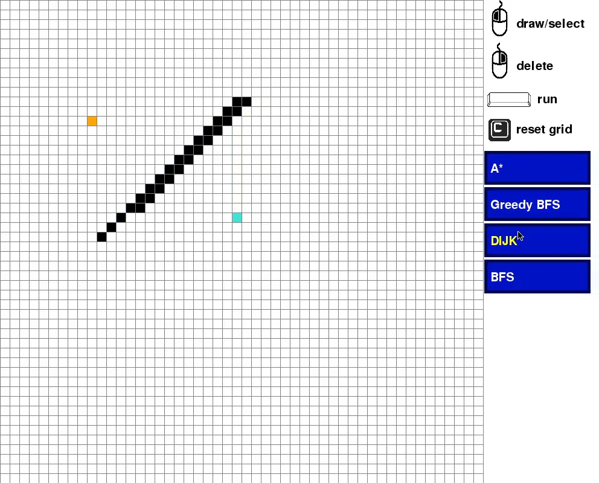
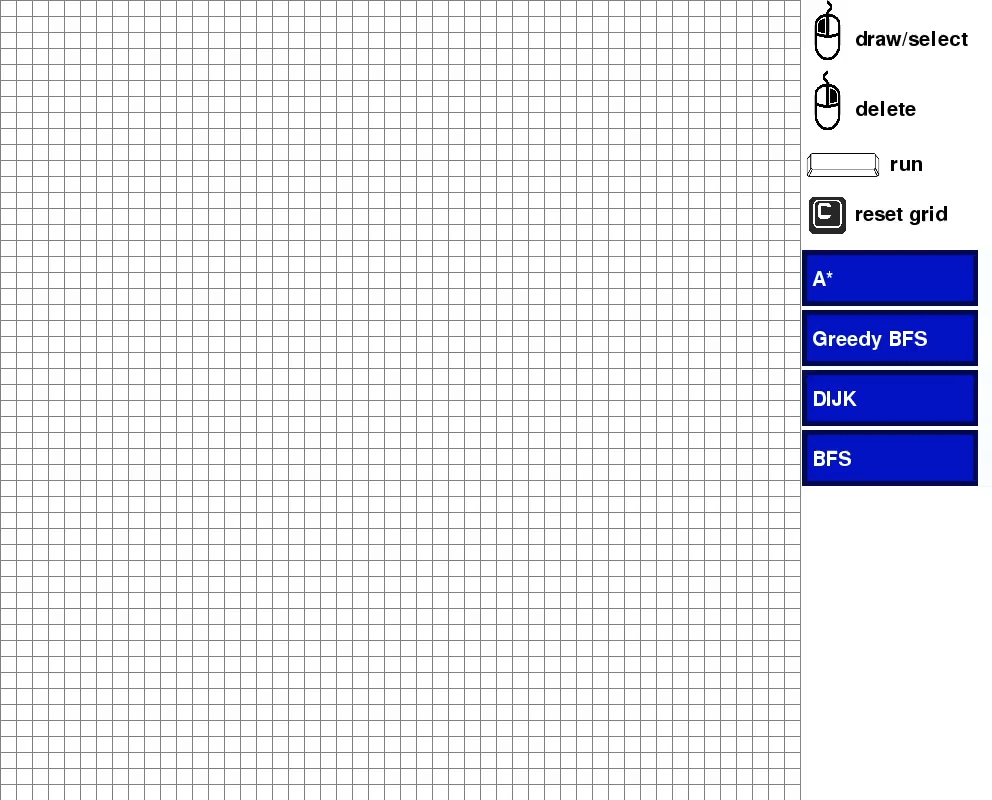
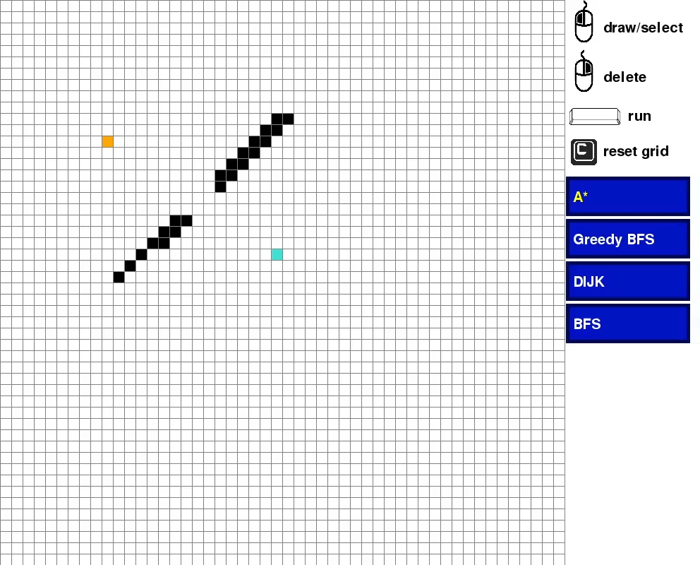

# Pathfinding Algorithms
As a personal project, I implemented the A*, Dijkstra, Greedy Best First Search and the Breadth-First Search algorithm with a Pygame GUI (path_algos.py).

In this example the Dijkstra algorithm can be seen. The orange node depicts the start point, the turquoise node the end point and black nodes correspond to an obstacle. The algorithm proceeds through the grid and marks visited nodes in light blue. Finally, the shortest path between the two nodes is highlighted in yellow.



## Requirements
Pygame, key_c.png, mouse_button.png, right_button.png and spacebar.jpg

## Instruction
The start and end nodes can be set through left clicks with the mouse at the grid GUI. After the first two clicks, obstacles can be drawn into the grid structure.


The user chooses between algorithms by clicking at the algorithm's name. By pressing the spacebar, the algorithm starts to work through the grid.


Nodes in the grid can be deleted with right clicks.


To clear the grid, press "c"



## Algorithms
### The Grid structure
The node class
```
#node structure for the grid (x,y). every node is connected with maximum 4 neighbors. stored in neighbors
#diagonal connections are not allowed.
#a spot also holds a color for the visualization
class Spot:
	def __init__(self, row, col, width, total_rows):
		self.row = row
		self.col = col
		self.x = row * width
		self.y = col * width
		#unaccessed color = white
		self.color = WHITE
		self.neighbors = []
		self.width = width
		self.total_rows = total_rows
		#the color might changes after a certain step interval
		self.time_effekt = 0

	def get_pos(self):
		return self.row, self.col

	def is_closed(self):
		return self.color == RED

	def is_open(self):
		return self.color == GREEN

	def is_barrier(self):
		return self.color == BLACK

	def is_start(self):
		return self.color == ORANGE

	def is_end(self):
		return self.color == TURQUOISE

	def reset(self):
		self.color = WHITE

	def make_start(self):
		self.color = ORANGE

	#after 7 steps, change the color
	def make_closed(self):
		self.color = RED
		self.time_effekt = 7

	def make_open(self):
		self.color = GREEN

	def make_barrier(self):
		self.color = BLACK

	def check_barrier(self):
		if self.color == BLACK:
			return True

	def make_end(self):
		self.color = TURQUOISE

	def make_path(self):
		self.color = YELLOW

	def draw(self, win):
		#change the color after a certain step interval
		if self.time_effekt > 0 and self.is_closed():
			pygame.draw.rect(win, EFFECTCOLOR, (self.x, self.y, self.width, self.width))
			self.time_effekt += -1
		else:
			pygame.draw.rect(win, self.color, (self.x, self.y, self.width, self.width))

	#assigns all the possible neighbors (max:D,U,R,L), barriers for example are not allowed to be a neighbor
	def update_neighbors(self, grid):
		self.neighbors = []
		#             can still move down          is not a barrier
		if self.row < self.total_rows - 1 and not grid[self.row + 1][self.col].is_barrier(): # DOWN
			self.neighbors.append(grid[self.row + 1][self.col])
		#(0,0) is the upper right corner
		if self.row > 0 and not grid[self.row - 1][self.col].is_barrier(): # UP
			self.neighbors.append(grid[self.row - 1][self.col])
		# number of rows=number of columns
		if self.col < self.total_rows - 1 and not grid[self.row][self.col + 1].is_barrier(): # RIGHT
			self.neighbors.append(grid[self.row][self.col + 1])

		if self.col > 0 and not grid[self.row][self.col - 1].is_barrier(): # LEFT
			self.neighbors.append(grid[self.row][self.col - 1])

	def __lt__(self, other):
		return False
 ```

And the grid initializer
 ```
#data structure for the grid
def make_grid(rows, width):
	grid = []
	#how large a button is going to be
	gap = width // rows
	for i in range(rows):
		grid.append([])
		for j in range(rows):
			spot = Spot(i, j, gap, rows)
			grid[i].append(spot)
	return grid
 ```
 
### A*
```#A* algo
def algorithm(draw, grid, start, end):
	#to get a tie braker for equal fs
	count = 0
	#to get the min element
	open_set = PriorityQueue()
	open_set.put((0, count, start))
	#dictionary to assign nodes to nodes to create the shortest path
	came_from = {}
	#setting g and f scores to inf at the beginning, except for the start pos
	g_score = {spot: float("inf") for row in grid for spot in row}
	g_score[start] = 0
	f_score = {spot: float("inf") for row in grid for spot in row}
	#manhattan dist
	f_score[start] = h(start.get_pos(), end.get_pos())
	open_set_hash = {start}

	while not open_set.empty():
		for event in pygame.event.get():
			if event.type == pygame.QUIT:
				pygame.quit()
		#get the minimum val node
		current = open_set.get()[2]
		open_set_hash.remove(current)
		#shortest path found
		if current == end:
			reconstruct_path(came_from, start, end, draw)
			end.make_end()
			return True

		for neighbor in current.neighbors:
			#updating the g_score for the neighbors
			temp_g_score = g_score[current] + 1
			#if a neighbor has a new lower value, save the new val
			if temp_g_score < g_score[neighbor]:
				came_from[neighbor] = current
				g_score[neighbor] = temp_g_score
				#manhattan dist + steps
				f_score[neighbor] = temp_g_score + h(neighbor.get_pos(), end.get_pos())
				if neighbor not in open_set_hash:
					count += 1
					open_set.put((f_score[neighbor], count, neighbor))
					open_set_hash.add(neighbor)
		draw()
		if current != start:
			current.make_closed()
	return False
  ```

### Dijkstra
```
#dij
def dijk(draw, grid, start, end):
	#to get a tie braker for equal fs
	count = 0
	#to get the min element
	open_set = PriorityQueue()
	open_set.put((0, count, start))
	#dictionary to assign nodes to nodes to create the shortest path
	came_from = {}
	g_score = {spot: float("inf") for row in grid for spot in row}
	g_score[start] = 0
	open_set_hash = {start}

	while not open_set.empty():
		for event in pygame.event.get():
			if event.type == pygame.QUIT:
				pygame.quit()
		#get the minimum val node
		current = open_set.get()[2]
		open_set_hash.remove(current)
		#shortest path found
		if current == end:
			reconstruct_path(came_from, start, end, draw)
			end.make_end()
			return True
		#if a neighbor has a new lower val, save it
		for neighbor in current.neighbors:
			temp_g_score = g_score[current] + 1
			if temp_g_score < g_score[neighbor]:
				came_from[neighbor] = current
				g_score[neighbor] = temp_g_score
				if neighbor not in open_set_hash:
					count += 1
					open_set.put((g_score[neighbor], count, neighbor))
					open_set_hash.add(neighbor)
		draw()
		if current != start:
			current.make_closed()

	return False
```

### Greedy Best First Search, with Manhattan dist
```
def greedy(draw, grid, start, end):
	#to get the min element, x value as tie braker
	open_set = PriorityQueue()
	open_set.put((0, start.get_pos()[1], start))
	#dictionary to assign nodes to nodes to create the shortest path
	came_from = {}
	#heuristic, manhattan dist
	f_score = {spot: float("inf") for row in grid for spot in row}
	f_score[start] = h(start.get_pos(), end.get_pos())
	open_set_hash = {start}

	while not open_set.empty():
		for event in pygame.event.get():
			if event.type == pygame.QUIT:
				pygame.quit()
		#get the minimum val node
		current = open_set.get()[2]
		open_set_hash.remove(current)
		#shortest path found
		if current == end:
			reconstruct_path(came_from, start, end, draw)
			end.make_end()
			return True

		for neighbor in current.neighbors:
				#add neighbor to the stack, if it hasn't been visited yet
				if neighbor not in open_set_hash and not neighbor.is_closed():
					# calculate the heuristics for the neighbors
					f_score[neighbor] = h(neighbor.get_pos(), end.get_pos())
					if current != start:
						came_from[neighbor] = current
					open_set.put((f_score[neighbor], neighbor.get_pos()[1], neighbor))
					open_set_hash.add(neighbor)
		draw()

		if current != start:
			current.make_closed()

	return False
```

### BFS
```
# finds shortest path between 2 nodes of a graph using BFS
def bfs(draw, grid, start, end):
	# keep track of explored nodes
	explored = []
	# keep track of all the paths to be checked
	queue = [[start]]

	# keeps looping until all possible paths have been checked
	while queue:
		# pop the first path from the queue
		path = queue.pop(0)
		# get the last node from the path
		node = path[len(path)-1]

		if node not in explored:
			neighbours = node.neighbors
			# go through all neighbour nodes and build a new path
			# if it was never visited, mark it for the visualization
			for neighbour in neighbours:
				if neighbour.color == WHITE:
					neighbour.make_closed()
				new_path = list(path)
				#append the new element to the existing path
				new_path.append(neighbour)
				queue.append(new_path)

				if neighbour == end:
					#return new_path
					draw_path(draw, new_path, start, end)
					return None
			# mark node as explored
			explored.append(node)
		draw()
```
